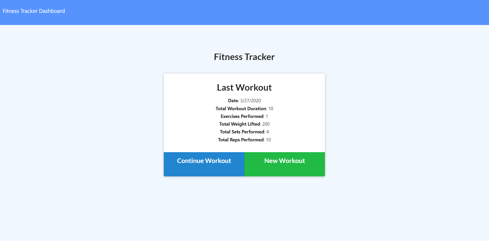

# WorkoutTracker

In this repository I created an application that tracks the user's workouts. The user is able to create a workout and add an exercise to the workout. Once added, the information of the user's last workout is displayed on the page. From there, the user can either add exercises to the workout, or create a new one with new exercises. There is also a stats page that allows the user to view infographics about their workouts.

[Here is a link to the application.](https://guarded-lake-48789.herokuapp.com/)

